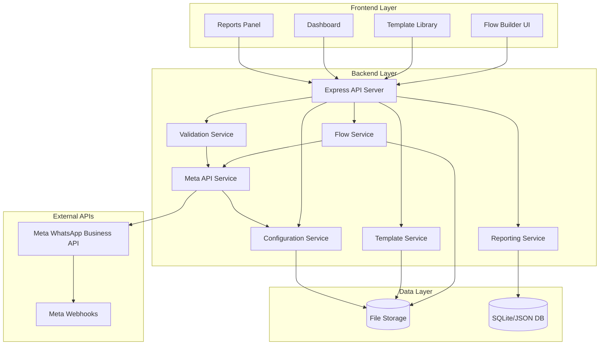

# Design Document

## Overview

The WhatsApp Flow Backend is a streamlined middleware system built with Node.js/Express that connects the frontend drag-and-drop flow builder with Meta's WhatsApp Business APIs. The system provides flow validation, template library management, API integration, and reporting capabilities.

The architecture follows a simplified monolithic approach with clear separation of concerns, focusing on core functionality that can be easily integrated into a larger product.

## Meta WhatsApp Flows API References

This design is based on the official Meta WhatsApp Flows API documentation:

1. [WhatsApp Flows Overview](https://developers.facebook.com/docs/whatsapp/flows/)
2. [Implementing Your Flow Endpoint](https://developers.facebook.com/docs/whatsapp/flows/guides/implementingyourflowendpoint)
3. [Sending a Flow](https://developers.facebook.com/docs/whatsapp/flows/guides/sendingaflow)
4. [Receiving Flow Responses](https://developers.facebook.com/docs/whatsapp/flows/guides/receiveflowresponse)
5. [Health Monitoring](https://developers.facebook.com/docs/whatsapp/flows/guides/healthmonitoring)
6. [Best Practices](https://developers.facebook.com/docs/whatsapp/flows/guides/bestpractices)
7. [Testing & Debugging](https://developers.facebook.com/docs/whatsapp/flows/guides/testingdebugging)
8. [Flow JSON Reference](https://developers.facebook.com/docs/whatsapp/flows/reference/flowjson)
9. [Flows API Reference](https://developers.facebook.com/docs/whatsapp/flows/reference/flowsapi)
10. [Error Codes](https://developers.facebook.com/docs/whatsapp/flows/reference/error-codes)
11. [Versioning](https://developers.facebook.com/docs/whatsapp/flows/reference/versioning)
12. [Metrics API](https://developers.facebook.com/docs/whatsapp/flows/reference/metrics_api)
13. [Flows Webhooks](https://developers.facebook.com/docs/whatsapp/flows/reference/flowswebhooks)
14. [Flow Lifecycle](https://developers.facebook.com/docs/whatsapp/flows/reference/lifecycle)
15. [Components Reference](https://developers.facebook.com/docs/whatsapp/flows/reference/components)
16. [Media Upload](https://developers.facebook.com/docs/whatsapp/flows/reference/media_upload)
17. [Changelogs](https://developers.facebook.com/docs/whatsapp/flows/changelogs)

## Architecture

### High-Level Architecture



### Service Architecture

The system is composed of several microservices, each with specific responsibilities:

1. **API Gateway**: Entry point, authentication, rate limiting
2. **Flow Service**: Core flow CRUD operations and management
3. **Validation Service**: Flow structure validation and correction
4. **Library Service**: Template and component library management
5. **Meta API Service**: WhatsApp Business API integration
6. **Analytics Service**: Usage tracking and reporting

## Components and Interfaces

### Frontend System Analysis

Based on the existing frontend codebase, the system includes:

**Core UI Components**:
- **Dashboard**: KPI overview, recent flows, quick actions
- **FlowsStudio**: Flow management interface with search, filtering, and CRUD operations
- **FlowBuilder**: Visual drag-and-drop editor with 3-panel layout
- **ComponentPalette**: 20+ WhatsApp component types (Text, Input, Media, Action, Container)
- **Stage/FlowCanvas**: React Flow-based visual editor with screen nodes and connections
- **InspectorPanel**: Properties editor with JSON view and validation
- **DataExchangeModal**: Endpoint configuration, encryption settings, API console

**Advanced Features**:
- **Interactive/Static Preview**: Phone mockup with WhatsApp UI simulation
- **Image Upload**: File handling with validation and preview
- **Validation System**: Real-time flow validation with error highlighting
- **Drag & Drop**: Component placement and reordering
- **Screen Management**: Multi-screen flows with navigation logic
- **Export/Import**: JSON flow export functionality

### 1. API Gateway Layer

**Purpose**: Centralized entry point for all client requests, enhanced to support the rich frontend feature set

**Key Components**:
- Express.js server with middleware pipeline
- JWT-based authentication with role-based access control
- Rate limiting with Redis backend (per-user and per-endpoint)
- Request/response logging with correlation IDs
- CORS handling with environment-specific origins
- File upload handling for images and documents
- WebSocket support for real-time collaboration

**Interfaces**:
```typescript
interface APIGatewayConfig {
  port: number;
  corsOrigins: string[];
  rateLimits: {
    windowMs: number;
    maxRequests: number;
    skipSuccessfulRequests: boolean;
  };
  jwtSecret: string;
  uploadLimits: {
    maxFileSize: number;
    allowedMimeTypes: string[];
  };
  websocket: {
    enabled: boolean;
    pingInterval: number;
  };
}

interface AuthenticatedRequest extends Request {
  user: {
    id: string;
    email: string;
    name: string;
    role: 'admin' | 'user' | 'viewer';
    permissions: string[];
    organizationId?: string;
  };
  correlationId: string;
}
```

### 2. Flow Service

**Purpose**: Manages flow lifecycle, CRUD operations, and deployment orchestration

**Key Components**:
- Flow CRUD operations
- Deployment pipeline management
- Version control and history
- Flow sharing and permissions

**Interfaces**:
```typescript
interface FlowService {
  createFlow(userId: string, flowData: FlowDefinition): Promise<Flow>;
  updateFlow(flowId: string, updates: Partial<FlowDefinition>): Promise<Flow>;
  deployFlow(flowId: string, deploymentConfig: DeploymentConfig): Promise<DeploymentResult>;
  getFlowHistory(flowId: string): Promise<FlowVersion[]>;
  shareFlow(flowId: string, shareConfig: ShareConfig): Promise<ShareResult>;
}

interface FlowDefinition {
  name: string;
  version: string;
  data_api_version: string;
  screens: Screen[];
  routing_model: RoutingModel;
  metadata: FlowMetadata;
}

interface DeploymentConfig {
  environment: 'staging' | 'production';
  autoPublish: boolean;
  rollbackOnError: boolean;
}
```

### 3. Validation Service

**Purpose**: Validates flow structures against Meta specifications and provides auto-correction

**Key Components**:
- Schema validation engine
- Auto-correction algorithms
- Error reporting and suggestions
- Compliance checking

**Interfaces**:
```typescript
interface ValidationService {
  validateFlow(flow: FlowDefinition): Promise<ValidationResult>;
  autoCorrectFlow(flow: FlowDefinition): Promise<CorrectionResult>;
  validateComponent(component: FlowComponent): Promise<ComponentValidationResult>;
  getValidationSchema(version: string): Promise<ValidationSchema>;
}

interface ValidationResult {
  isValid: boolean;
  errors: ValidationError[];
  warnings: ValidationWarning[];
  suggestions: ValidationSuggestion[];
}

interface ValidationError {
  path: string;
  message: string;
  severity: 'error' | 'warning';
  code: string;
  autoFixAvailable: boolean;
}

interface CorrectionResult {
  correctedFlow: FlowDefinition;
  appliedFixes: AppliedFix[];
  remainingIssues: ValidationError[];
}
```

### 4. Library Service

**Purpose**: Manages flow templates, components, and reusable assets

**Key Components**:
- Template management system
- Component library
- Search and categorization
- Usage analytics
- Version control for templates

**Interfaces**:
```typescript
interface LibraryService {
  getTemplates(filters: TemplateFilters): Promise<Template[]>;
  createTemplate(template: TemplateDefinition): Promise<Template>;
  searchLibrary(query: SearchQuery): Promise<SearchResult>;
  getPopularTemplates(category?: string): Promise<Template[]>;
  trackTemplateUsage(templateId: string, userId: string): Promise<void>;
}

interface Template {
  id: string;
  name: string;
  description: string;
  category: string;
  tags: string[];
  flowDefinition: FlowDefinition;
  previewImage: string;
  usageCount: number;
  rating: number;
  createdBy: string;
  createdAt: Date;
  updatedAt: Date;
}

interface SearchQuery {
  query: string;
  category?: string;
  tags?: string[];
  sortBy: 'relevance' | 'popularity' | 'recent';
  limit: number;
  offset: number;
}
```

### 5. Meta API Service

**Purpose**: Handles all interactions with WhatsApp Business APIs following official Meta documentation

**Key Components**:
- **Flows API Integration**: Complete CRUD operations for flows
- **Media Upload API**: Handle image and document uploads
- **Metrics API**: Flow performance and analytics data
- **Webhook Processing**: Handle flow completion and data exchange
- **Version Management**: Support multiple Flow JSON versions (3.0, 4.0, 5.0, 6.0, 7.0, 7.1)
- **Rate Limiting**: Respect Meta's API rate limits and quotas
- **Error Handling**: Comprehensive error mapping and retry logic

**Meta Flows API Endpoints**:
```typescript
interface MetaFlowsAPI {
  // Flow Management (https://developers.facebook.com/docs/whatsapp/flows/reference/flowsapi)
  createFlow(params: CreateFlowParams): Promise<FlowResponse>;
  updateFlow(flowId: string, params: UpdateFlowParams): Promise<FlowResponse>;
  getFlow(flowId: string): Promise<FlowResponse>;
  deleteFlow(flowId: string): Promise<DeleteResponse>;
  publishFlow(flowId: string): Promise<PublishResponse>;
  deprecateFlow(flowId: string): Promise<DeprecateResponse>;
  
  // Media Upload (https://developers.facebook.com/docs/whatsapp/flows/reference/media_upload)
  uploadMedia(file: MediaFile): Promise<MediaUploadResponse>;
  
  // Metrics (https://developers.facebook.com/docs/whatsapp/flows/reference/metrics_api)
  getFlowMetrics(flowId: string, params: MetricsParams): Promise<FlowMetrics>;
  
  // Webhook handling for flow completions
  processWebhook(payload: WebhookPayload): Promise<void>;
}

// Flow JSON Structure (https://developers.facebook.com/docs/whatsapp/flows/reference/flowjson)
interface FlowJSONDefinition {
  version: "3.0" | "4.0" | "5.0" | "6.0" | "7.0" | "7.1";
  data_api_version?: "3.0";
  routing_model?: Record<string, string[]>;
  screens: FlowScreen[];
}

interface FlowScreen {
  id: string;
  title: string;
  terminal?: boolean;
  success?: boolean;
  data: FlowComponent[];
  layout?: {
    type: "SingleColumnLayout";
    children: string[];
  };
}

// Meta API Request/Response Types
interface CreateFlowParams {
  name: string;
  categories: FlowCategory[];
  clone_flow_id?: string;
  endpoint_uri?: string;
}

interface UpdateFlowParams {
  name?: string;
  categories?: FlowCategory[];
  flow_json?: FlowJSONDefinition;
  endpoint_uri?: string;
  preview?: FlowPreview;
}

interface FlowResponse {
  id: string;
  name: string;
  status: FlowStatus;
  categories: FlowCategory[];
  validation_errors?: ValidationError[];
  json_version?: string;
  data_api_version?: string;
  endpoint_uri?: string;
  preview?: FlowPreview;
}

interface FlowStatus {
  status: "DRAFT" | "PUBLISHED" | "DEPRECATED" | "BLOCKED";
}

interface FlowCategory {
  category: "SIGN_UP" | "SIGN_IN" | "APPOINTMENT_BOOKING" | "LEAD_GENERATION" | 
           "CONTACT_US" | "CUSTOMER_SUPPORT" | "SURVEY" | "OTHER";
}

// Component Types (https://developers.facebook.com/docs/whatsapp/flows/reference/components)
interface FlowComponent {
  type: ComponentType;
  name?: string;
  [key: string]: any;
}

type ComponentType = 
  // Text Components
  | "TextHeading" | "TextSubheading" | "TextBody" | "TextCaption" | "RichText"
  // Input Components  
  | "TextInput" | "TextArea" | "CheckboxGroup" | "RadioButtonsGroup" 
  | "Dropdown" | "DatePicker" | "OptIn" | "ChipsSelector"
  // Media Components
  | "Image" | "ImageCarousel" | "PhotoPicker" | "DocumentPicker"
  // Action Components
  | "Button" | "Footer" | "EmbeddedLink"
  // Container Components
  | "Form";

// Media Upload Types
interface MediaFile {
  file: Buffer;
  type: "image/jpeg" | "image/png" | "image/webp";
  filename: string;
}

interface MediaUploadResponse {
  id: string;
  url: string;
  mime_type: string;
  file_size: number;
}

// Metrics API Types
interface MetricsParams {
  start: string; // ISO 8601 date
  end: string;   // ISO 8601 date
  granularity: "HOUR" | "DAY" | "WEEK" | "MONTH";
}

interface FlowMetrics {
  data: MetricDataPoint[];
  paging?: {
    cursors: {
      before: string;
      after: string;
    };
  };
}

interface MetricDataPoint {
  start_time: string;
  end_time: string;
  flow_started: number;
  flow_completed: number;
  flow_completion_rate: number;
}

// Error Handling
interface MetaAPIError {
  error: {
    message: string;
    type: string;
    code: number;
    error_subcode?: number;
    fbtrace_id: string;
    error_user_title?: string;
    error_user_msg?: string;
  };
}

// Webhook Types
interface WebhookPayload {
  object: "whatsapp_business_account";
  entry: WebhookEntry[];
}

interface WebhookEntry {
  id: string;
  changes: WebhookChange[];
}

interface WebhookChange {
  value: {
    messaging_product: "whatsapp";
    metadata: {
      display_phone_number: string;
      phone_number_id: string;
    };
    messages?: WebhookMessage[];
    statuses?: WebhookStatus[];
  };
  field: "messages";
}

interface WebhookMessage {
  from: string;
  id: string;
  timestamp: string;
  type: "interactive";
  interactive: {
    type: "nfm_reply";
    nfm_reply: {
      response_json: string;
      body: string;
      name: string;
    };
  };
}
```

### 6. Analytics Service

**Purpose**: Collects, processes, and reports on flow usage and performance metrics

**Key Components**:
- Event collection and processing
- Real-time dashboards
- Report generation
- Anomaly detection
- Data export capabilities

**Interfaces**:
```typescript
interface AnalyticsService {
  trackEvent(event: AnalyticsEvent): Promise<void>;
  getFlowMetrics(flowId: string, timeRange: TimeRange): Promise<FlowMetrics>;
  generateReport(reportConfig: ReportConfig): Promise<Report>;
  getSystemHealth(): Promise<SystemHealthMetrics>;
  detectAnomalies(metricType: string): Promise<Anomaly[]>;
}

interface AnalyticsEvent {
  type: string;
  userId: string;
  flowId?: string;
  timestamp: Date;
  properties: Record<string, any>;
}

interface FlowMetrics {
  deploymentCount: number;
  successRate: number;
  averageResponseTime: number;
  errorRate: number;
  usageByDay: DailyUsage[];
}
```

### 7. File Management Service

**Purpose**: Handles file uploads, storage, and processing for images and documents

**Key Components**:
- File upload validation and processing
- Image optimization and resizing
- CDN integration for fast delivery
- File metadata management
- Virus scanning and security checks

**Interfaces**:
```typescript
interface FileManagementService {
  uploadFile(file: FileUpload, userId: string): Promise<FileUploadResult>;
  processImage(fileId: string, options: ImageProcessingOptions): Promise<ProcessedImage>;
  deleteFile(fileId: string, userId: string): Promise<boolean>;
  getFileMetadata(fileId: string): Promise<FileMetadata>;
  generateSignedUrl(fileId: string, expiresIn: number): Promise<string>;
}

interface FileUpload {
  buffer: Buffer;
  originalName: string;
  mimeType: string;
  size: number;
}

interface FileUploadResult {
  fileId: string;
  url: string;
  thumbnailUrl?: string;
  metadata: FileMetadata;
}

interface ImageProcessingOptions {
  width?: number;
  height?: number;
  quality?: number;
  format?: 'jpeg' | 'png' | 'webp';
  generateThumbnail?: boolean;
}
```

### 8. Real-time Collaboration Service

**Purpose**: Enables real-time collaboration features for team-based flow development

**Key Components**:
- WebSocket connection management
- Operational transformation for conflict resolution
- User presence tracking
- Change broadcasting
- Collaborative editing locks

**Interfaces**:
```typescript
interface CollaborationService {
  joinFlowSession(flowId: string, userId: string): Promise<FlowSession>;
  leaveFlowSession(sessionId: string): Promise<void>;
  broadcastChange(sessionId: string, change: FlowChange): Promise<void>;
  lockComponent(sessionId: string, componentId: string): Promise<boolean>;
  unlockComponent(sessionId: string, componentId: string): Promise<void>;
  getActiveUsers(flowId: string): Promise<ActiveUser[]>;
}

interface FlowSession {
  id: string;
  flowId: string;
  userId: string;
  joinedAt: Date;
  permissions: CollaborationPermission[];
}

interface FlowChange {
  type: 'component_update' | 'component_add' | 'component_delete' | 'screen_update';
  path: string;
  data: any;
  userId: string;
  timestamp: Date;
}

interface ActiveUser {
  id: string;
  name: string;
  avatar?: string;
  cursor?: { x: number; y: number };
  selectedComponent?: string;
}
```

### 9. Data Exchange Service

**Purpose**: Manages external endpoint configurations and data exchange settings

**Key Components**:
- Endpoint configuration management
- Encryption key management
- Connection testing and validation
- Data transformation and mapping
- Webhook payload processing

**Interfaces**:
```typescript
interface DataExchangeService {
  configureEndpoint(userId: string, config: EndpointConfig): Promise<EndpointConfiguration>;
  testEndpoint(configId: string): Promise<EndpointTestResult>;
  updateEncryption(configId: string, encryption: EncryptionConfig): Promise<boolean>;
  processWebhookData(flowId: string, data: any): Promise<ProcessedData>;
  getEndpointLogs(configId: string, filters: LogFilters): Promise<EndpointLog[]>;
}

interface EndpointConfig {
  url: string;
  method: 'POST' | 'PUT';
  headers?: Record<string, string>;
  authentication?: {
    type: 'bearer' | 'basic' | 'api_key';
    credentials: Record<string, string>;
  };
  encryption?: EncryptionConfig;
}

interface EncryptionConfig {
  enabled: boolean;
  publicKey?: string;
  algorithm: 'RSA-OAEP' | 'AES-256-GCM';
  keySize?: number;
}

interface EndpointTestResult {
  success: boolean;
  responseTime: number;
  statusCode: number;
  error?: string;
  capabilities?: string[];
}
```

### 10. Component Definition Service

**Purpose**: Manages WhatsApp component definitions, validation rules, and compatibility

**Key Components**:
- Component schema management
- Version compatibility checking
- Default property generation
- Component validation rules
- API version mapping

**Interfaces**:
```typescript
interface ComponentDefinitionService {
  getComponentTypes(apiVersion: string): Promise<ComponentType[]>;
  validateComponent(component: FlowComponent, apiVersion: string): Promise<ComponentValidationResult>;
  getDefaultProperties(componentType: string, apiVersion: string): Promise<ComponentProperties>;
  checkCompatibility(flow: FlowDefinition): Promise<CompatibilityReport>;
  migrateComponent(component: FlowComponent, targetVersion: string): Promise<FlowComponent>;
}

interface ComponentType {
  type: string;
  label: string;
  category: string;
  description: string;
  supportedVersions: string[];
  properties: ComponentPropertyDefinition[];
  constraints: ComponentConstraint[];
}

interface ComponentPropertyDefinition {
  name: string;
  type: 'string' | 'number' | 'boolean' | 'array' | 'object';
  required: boolean;
  defaultValue?: any;
  validation?: ValidationRule[];
}

interface CompatibilityReport {
  compatible: boolean;
  issues: CompatibilityIssue[];
  recommendations: string[];
  migrationPath?: MigrationStep[];
}
```

## Data Models

### Core Data Models

```typescript
// Flow Management
interface Flow {
  id: string;
  userId: string;
  name: string;
  description?: string;
  flowDefinition: FlowDefinition;
  status: 'draft' | 'deployed' | 'published' | 'archived';
  metaFlowId?: string;
  version: number;
  createdAt: Date;
  updatedAt: Date;
  deployedAt?: Date;
  publishedAt?: Date;
}

interface FlowVersion {
  id: string;
  flowId: string;
  version: number;
  flowDefinition: FlowDefinition;
  changeLog: string;
  createdAt: Date;
  createdBy: string;
}

// Library Management
interface Template {
  id: string;
  name: string;
  description: string;
  category: string;
  tags: string[];
  flowDefinition: FlowDefinition;
  previewImage?: string;
  isPublic: boolean;
  createdBy: string;
  usageCount: number;
  rating: number;
  reviews: TemplateReview[];
  createdAt: Date;
  updatedAt: Date;
}

// User Management
interface User {
  id: string;
  email: string;
  name: string;
  role: 'admin' | 'user' | 'viewer';
  permissions: Permission[];
  metaAccessToken?: string;
  metaTokenExpiry?: Date;
  createdAt: Date;
  lastLoginAt?: Date;
}

// Analytics
interface AnalyticsEvent {
  id: string;
  type: string;
  userId: string;
  flowId?: string;
  sessionId: string;
  properties: Record<string, any>;
  timestamp: Date;
}
```

## Error Handling

### Error Classification System

```typescript
enum ErrorType {
  VALIDATION_ERROR = 'VALIDATION_ERROR',
  META_API_ERROR = 'META_API_ERROR',
  AUTHENTICATION_ERROR = 'AUTHENTICATION_ERROR',
  AUTHORIZATION_ERROR = 'AUTHORIZATION_ERROR',
  RATE_LIMIT_ERROR = 'RATE_LIMIT_ERROR',
  SYSTEM_ERROR = 'SYSTEM_ERROR'
}

interface APIError {
  type: ErrorType;
  code: string;
  message: string;
  details?: any;
  path?: string;
  timestamp: Date;
  requestId: string;
  userId?: string;
}
```

### Error Handling Strategy

1. **Graceful Degradation**: System continues operating with reduced functionality
2. **Automatic Retry**: Exponential backoff for transient errors
3. **Circuit Breaker**: Prevent cascade failures
4. **Detailed Logging**: Comprehensive error tracking for debugging
5. **User-Friendly Messages**: Translate technical errors to actionable user messages

## Testing Strategy

### Testing Pyramid

1. **Unit Tests** (70%):
   - Service layer logic
   - Validation algorithms
   - Data transformations
   - Utility functions

2. **Integration Tests** (20%):
   - API endpoint testing
   - Database operations
   - External service mocking
   - End-to-end workflows

3. **E2E Tests** (10%):
   - Complete user journeys
   - Meta API integration
   - Performance testing
   - Load testing

### Testing Tools and Frameworks

- **Jest**: Unit and integration testing
- **Supertest**: API endpoint testing
- **Docker**: Test environment isolation
- **Mock Service Worker**: API mocking
- **Artillery**: Load testing
- **Cypress**: E2E testing

### Test Data Management

- **Test Fixtures**: Predefined test data sets
- **Database Seeding**: Consistent test environments
- **Mock Meta API**: Simulated Meta API responses
- **Test User Management**: Isolated test user accounts